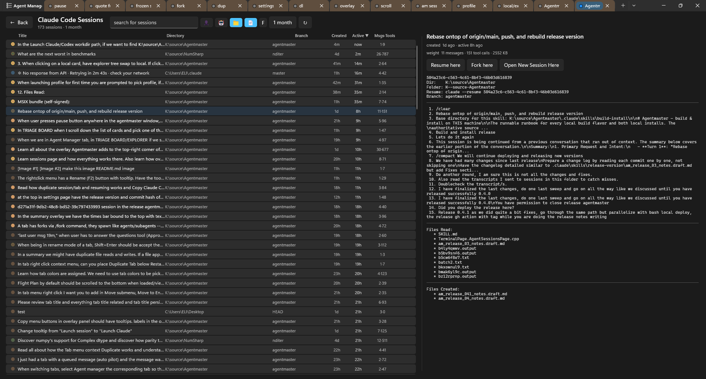
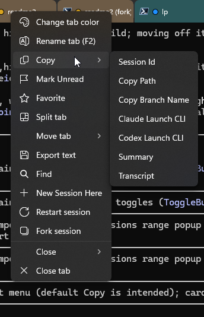

# Agentmaster
_By developers, for developers - Never lose a session again - feel like Windows Terminal so you forget you are vibing_

[Microsoft Windows Terminal](https://github.com/microsoft/terminal) but pumped up with observability, persistence and all the tools you need to scale up your parallel context management.<br/> Coding fast is no longer about typing faster but about holding and manuvering around and between 10 coding contextes.

Each session is a real `claude.exe` on a **ConPTY** connection: a full-fidelity terminal with a shared stdin (you and the orchestrator coexist), output tapped for the UI, and semantic state from **Claude Code hooks** and an **out-of-band observer** — never screen-scraping.

[](https://raw.githubusercontent.com/Nucs/Agentmaster/agentmaster/doc/agentmaster/img/agent-manager.png)

## ✨ What it does for you

### 🗂️ One tab to run the whole fleet
A pinned **Manager** tab is mission control: a **Triage Board** that sorts every session into *Running · Waiting-for-you · Needs-approval · Error · Done*, an **Explorer Tree** of your working-dirs → sessions, and a **Flight Plan** to queue prompts per session. Click a card and its terminal tab follows — both ways, across every window — so you never lose which tab is which.

### 💾 Never lose a session — ever
Close a window and reopen it **whole**: geometry, **resumed** Claude *and* Codex conversations, shell tabs back at their real cwd, even the focused tab. And the **Sessions browser** searches *every* conversation that's ever hit disk — an instant index, then ripgrep across the actual content — so you can **Resume or Fork** anything, from any day. Closing only archives a session; your transcripts are never deleted.

### 👀 Manages every agent — even the ones you didn't launch
The **Fleet Observer** detects, correlates, and enriches *every* Claude/Codex session by reading process memory and transcripts **out-of-band** — no hooks, no setup, completely invisible to the shell. Hand-type `claude` in any tab and it's managed within seconds. Sessions running *outside* the app show up too: watch them read-only, or **adopt** them (fork a safe copy, or resume).

### 🚦 Know who needs you — at a glance
State is **never screen-scraped**: it's hook-derived and then self-healed from the transcript, so dropped or out-of-order events can't lie to you. It drives a **board column** and a hover card carrying the conversation's **recap** (*"what we did / what's next"*). **Waiting-for-you** works like an unread inbox: a finished turn stays flagged until you've actually looked at it.

### 🔎 Observability everywhere — every tab is a status lens
You never have to open the Manager to read a session. Every classified tab wears a **state-colored dot** in the strip and a **top-right overlay badge** — *status · `model · effort · kind` · Autopilot · queued · workdir/branch · the next queued prompt* — that flips live as the session moves, with a one-hover **copy** menu — also on the **tab's right-click menu** — for its id / path / branch / **real launch CLI** / summary / transcript. The badge's **pencil** unfolds a per-tab **summary panel** (plan · tasks · prompts · files read/created/edited), and a per-prompt **Jump** (or **Alt+↑/↓**) scrolls straight to where a prompt was sent. Even a plain shell tab keeps a dim `○ kind · unlinked` twin — nothing in your strip is a mystery.

<table>
<tr>
<td width="74%" valign="top">
<a href="https://raw.githubusercontent.com/Nucs/Agentmaster/agentmaster/doc/agentmaster/img/sessions-browser.png"></a>
</td>
<td width="26%" valign="top">
<a href="https://raw.githubusercontent.com/Nucs/Agentmaster/agentmaster/doc/agentmaster/img/tab-copy-menu.png"></a>
</td>
</tr>
</table>

> **And the small stuff that adds up:** **★ favorite** a session to pin it, permanent **per-directory tab colors** (a folder keeps its color across tabs, windows, and restarts), per-install **profiles** so a from-source dev build sits beside the release, and a **Settings** cog for the knobs (model · env · Autopilot defaults).

#### Additional features
- **Autopilot** — auto-sends the next queued prompt on turn-complete (Full / Semi / Manual), with stop-on-error · max-sends · pause-on-input · question-guard · Enter-retry, and savable plan templates.
- **`agentmaster` CLI** — query the fleet from any shell, app up or down (`show` / `list` / `sessions` / `tabs` / `windows` / `external`, `--self`, `--json`).
- **In-app updater** — checks GitHub on launch and from Settings → Updates; one-click update, pre-release opt-in, and uninstall.
- **Keep Awake** — toolbar toggle (Off / Always / While-Running) so the machine won't sleep mid-run.
- **Context-window usage** — every card shows how full the conversation's context is (e.g. `ctx 182K`).
- **Never dead-ends** — quit an agent and you land on a live shell prompt at its cwd, not a dead pane.
- **Sessions row Filter** — right-click a row to narrow the list by dir / branch / day / week / month / fork-family.
- **Favorite crown** — a starred session wears a gold crown on its tab-strip dot.
- **Home / Jump-Back** — jump to the pinned Manager tab and back to where you were.
- **Hide / Unhide** — drop a session from the Sessions list (reversible; the transcript is untouched).

## 🟢 Status

In active use, shipping regular [**releases**](https://github.com/Nucs/Agentmaster/releases). The full pipeline runs end-to-end in the packaged app; the standalone engine harness passes **1,100+** checks.

- **Claude Code** — fully managed: launch · observe · drive · persist · restore.
- **Codex** (OpenAI Codex CLI) — managed for observe + state + the full launch / restore / adopt lifecycle (driving its TUI is next).
- **Every session** — the Observer manages them whether they fire hooks or not; external ones stay read-only until you adopt.
- Installs **side-by-side** under its own identity — your real Windows Terminal is left untouched.

## ⬇️ Install

**One line, no download** — paste into PowerShell. It grabs the latest release, verifies the signature, and trusts the cert behind a single UAC prompt (skipped on upgrades once trusted):

```powershell
& ([scriptblock]::Create((irm https://raw.githubusercontent.com/Nucs/Agentmaster/agentmaster/tools/Install-Agentmaster.ps1)))
```

Flags: `-Version <x.y.z>` · `-Portable` (cert-free, no admin) · `-Launch` · `-Prerelease` · `-Force` · `-Uninstall`.

Prefer the files? Grab them from [**Releases**](https://github.com/Nucs/Agentmaster/releases): the **portable zip** (unzip, run `agentmaster.exe` — fully self-contained, no cert) or the self-signed **`.msixbundle`** (trust `Agentmaster.cer` once, then `Add-AppxPackage`).

First launch silently picks a per-install **profile folder** (`~/.agentmaster`) holding everything it persists. **Requires** Windows 10 19041+, x64/arm64, and a native [Claude Code](https://www.anthropic.com/claude-code) `claude.exe` on `PATH` (Codex optional).

## 📚 Docs & building

- **Start here:** [`CLAUDE.md`](CLAUDE.md) — full working notes (status by area, build/deploy, gotchas, correctness rules) · [`DESIGN`](doc/agentmaster/DESIGN.md) · [`IMPLEMENTATION`](doc/agentmaster/IMPLEMENTATION.md)
- **Internals:** [`OBSERVER`](doc/agentmaster/OBSERVER.md) · [`HOOKS`](doc/agentmaster/HOOKS.md) · [`STATE`](doc/agentmaster/STATE.md) · [`SESSIONS`](doc/agentmaster/SESSIONS.md) · [`PERSISTENCE`](doc/agentmaster/PERSISTENCE.md) · [`PROFILES`](doc/agentmaster/PROFILES.md) · [`CLI`](doc/agentmaster/CLI.md) · [`TAB_OVERLAY`](doc/agentmaster/TAB_OVERLAY.md)

Build it with VS 2022 (*Desktop C++* + *UWP* workloads, Windows SDK 10.0.22621/26100):

```powershell
pwsh -File .\tools\Build-Agentmaster.ps1            # first build (restores packages)
pwsh -File .\tools\Build-Agentmaster.ps1 -NoRestore # inner loop
```

To run from source, deploy the loose layout (registers the **dev** identity `AgentmasterDev`, which coexists with the release):

```powershell
Add-AppxPackage -Register ".\src\cascadia\CascadiaPackage\bin\x64\Debug\AppxManifest.xml" -ForceUpdateFromAnyVersion
```

Our code is additive and marked `Agentmaster`: the Manager UI in `AgentManagerContent`, the plain-C++ engine + Fleet Observer under `src/cascadia/TerminalApp/AgentMaster/`, the per-tab overlay `AgentTabOverlay`, and small touches at the `TerminalPage` / `Tab` integration points.

## 🔗 Relationship to Windows Terminal & License

A fork of [`microsoft/terminal`](https://github.com/microsoft/terminal) at `v1.24.2372` — pristine upstream on `main`, the fork's work on `agentmaster`; upstream code, docs, and notices are retained ([`NOTICE.md`](NOTICE.md)). Licensed [MIT](LICENSE), same as upstream, with the original `Copyright (c) Microsoft Corporation` notice kept alongside the fork author's. For Windows Terminal itself, see [aka.ms/terminal-docs](https://aka.ms/terminal-docs).

---

> *This feels like the entire codebase went into `Form1.cs`, but patience and careful designing made this little gem.*
