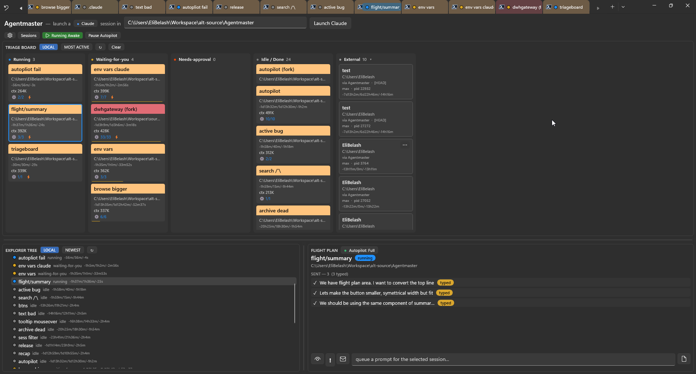

# 🛰️ Agentmaster

> **Mission control for your AI coding agents.** Run a dozen Claude Code & Codex sessions in parallel — across every repo — without losing track of one, or losing a single conversation.

[](https://github.com/Nucs/Agentmaster/releases)
[](#-install)
[](https://github.com/microsoft/terminal)
[](LICENSE)
[](https://github.com/Nucs/Agentmaster/stargazers)



You don't code faster by typing faster anymore — you code faster by running **many agents at once**. But ten parallel sessions across ten repos turns into chaos: *which one is waiting on me? what did the one in the other window decide? did I just lose it when that window closed?*

**Agentmaster** is [Windows Terminal](https://github.com/microsoft/terminal) turned into mission control for that fleet. Every session is a real `claude.exe` (or Codex) on a ConPTY — a full-fidelity terminal you can still type into — with its state read **out-of-band**, so you can *see* and *steer* all of them at once. It still feels like Windows Terminal; you just stop dropping contexts.

## ✨ What it does for you

### 🗂️ One tab to run the whole fleet
A pinned **Manager** tab is mission control: a **Triage Board** that sorts every session into *Running · Waiting-for-you · Needs-approval · Error · Done*, an **Explorer Tree** of your working-dirs → sessions, and a **Flight Plan** to queue prompts per session. Click a card and its terminal tab follows — both ways, across every window — so you never lose which tab is which.

### 🤖 Autopilot — scale yourself, not your typing
Queue a plan and the next prompt fires the instant a turn finishes (**Full**), or with one tap (**Semi**). It's bounded by real backstops — stop-on-error, max-sends, pause-the-moment-you-touch-the-keyboard, a clarifying-question guard — and it even re-presses Enter when the agent's TUI swallows a submit. Save a queue as a **template** and broadcast it across a whole directory.

### 💾 Never lose a session — ever
Close a window and reopen it **whole**: geometry, **resumed** Claude *and* Codex conversations, shell tabs back at their real cwd, even the focused tab. And the **Sessions browser** searches *every* conversation that's ever hit disk — an instant index, then ripgrep across the actual content — so you can **Resume or Fork** anything, from any day. Closing only archives a session; your transcripts are never deleted.

### 👀 Manages every agent — even the ones you didn't launch
The **Fleet Observer** detects, correlates, and enriches *every* Claude/Codex session by reading process memory and transcripts **out-of-band** — no hooks, no setup, completely invisible to the shell. Hand-type `claude` in any tab and it's managed within seconds. Sessions running *outside* the app show up too: watch them read-only, or **adopt** them (fork a safe copy, or resume).

### 🚦 Know who needs you — at a glance
State is **never screen-scraped**: it's hook-derived and then self-healed from the transcript, so dropped or out-of-order events can't lie to you. It shows up everywhere — a color dot on every tab, a board column, and a hover card carrying the conversation's **recap** (*"what we did / what's next"*). **Waiting-for-you** works like an unread inbox: a finished turn stays flagged until you've actually looked at it.

### 🌙 Built for long, unattended runs
**Keep Awake** stops your PC sleeping while agents grind through a backlog. Agentmaster **updates itself** from GitHub (one click, signed). And the **`agentmaster` CLI** introspects the whole fleet from any shell — app running or not — so you (or an agent) can ask *"what's going on in tab 3?"* and get a real answer.


> **And the small stuff that adds up:** a per-prompt **Jump** that scrolls the terminal to exactly where a prompt was sent (plus **Alt+↑/↓** to step through them), a per-tab **summary panel** (plan · tasks · files touched), **copy the real launch CLI** of any session, **★ favorite** a session to pin it, permanent **per-directory tab colors**, and per-install **profiles** so a from-source dev build sits right beside the release.

## 🟢 Status

In active use, shipping regular [**releases**](https://github.com/Nucs/Agentmaster/releases). The full pipeline runs end-to-end in the packaged app; the standalone engine harness passes **1,100+** checks.

- **Claude Code** — fully managed: launch · observe · drive (Autopilot) · persist · restore.
- **Codex** (OpenAI Codex CLI) — managed for observe + state + the full launch / restore / adopt lifecycle (driving its TUI is next).
- **Every session** — the Observer manages them whether they fire hooks or not; external ones stay read-only until you adopt.
- Installs **side-by-side** under its own identity — your real Windows Terminal is left untouched.

## ⬇️ Install

**One line, no download** — paste into PowerShell. It grabs the latest release, verifies the signature, and trusts the cert behind a single UAC prompt (skipped on upgrades once trusted):

```powershell
& ([scriptblock]::Create((irm https://raw.githubusercontent.com/Nucs/Agentmaster/agentmaster/tools/Install-Agentmaster.ps1)))
```

Flags: `-Version <x.y.z>` · `-Portable` (cert-free, no admin) · `-Launch` · `-Prerelease` · `-Force` · `-Uninstall`.

Prefer the files? Grab them from [**Releases**](https://github.com/Nucs/Agentmaster/releases): the **portable zip** (unzip, run `agentmaster.exe` — fully self-contained, no cert) or the self-signed **`.msixbundle`** (trust `Agentmaster.cer` once, then `Add-AppxPackage`).

First launch silently picks a per-install **profile folder** (`~/.agentmaster`) holding everything it persists. **Requires** Windows 10 19041+, x64/arm64, and a native [Claude Code](https://www.anthropic.com/claude-code) `claude.exe` on `PATH` (Codex optional).

## 📚 Docs & building

- **Start here:** [`CLAUDE.md`](CLAUDE.md) — full working notes (status by area, build/deploy, gotchas, correctness rules) · [`DESIGN`](doc/agentmaster/DESIGN.md) · [`IMPLEMENTATION`](doc/agentmaster/IMPLEMENTATION.md)
- **Internals:** [`OBSERVER`](doc/agentmaster/OBSERVER.md) · [`HOOKS`](doc/agentmaster/HOOKS.md) · [`STATE`](doc/agentmaster/STATE.md) · [`SESSIONS`](doc/agentmaster/SESSIONS.md) · [`PERSISTENCE`](doc/agentmaster/PERSISTENCE.md) · [`PROFILES`](doc/agentmaster/PROFILES.md) · [`CLI`](doc/agentmaster/CLI.md) · [`TAB_OVERLAY`](doc/agentmaster/TAB_OVERLAY.md)

Build it with VS 2022 (*Desktop C++* + *UWP* workloads, Windows SDK 10.0.22621/26100):

```powershell
pwsh -File .\tools\Build-Agentmaster.ps1            # first build (restores packages)
pwsh -File .\tools\Build-Agentmaster.ps1 -NoRestore # inner loop
```

To run from source, deploy the loose layout (registers the **dev** identity `AgentmasterDev`, which coexists with the release):

```powershell
Add-AppxPackage -Register ".\src\cascadia\CascadiaPackage\bin\x64\Debug\AppxManifest.xml" -ForceUpdateFromAnyVersion
```

Our code is additive and marked `Agentmaster`: the Manager UI in `AgentManagerContent`, the plain-C++ engine + Fleet Observer under `src/cascadia/TerminalApp/AgentMaster/`, the per-tab overlay `AgentTabOverlay`, and small touches at the `TerminalPage` / `Tab` integration points.

## 🔗 Relationship to Windows Terminal & License

A fork of [`microsoft/terminal`](https://github.com/microsoft/terminal) at `v1.24.2372` — pristine upstream on `main`, the fork's work on `agentmaster`; upstream code, docs, and notices are retained ([`NOTICE.md`](NOTICE.md)). Licensed [MIT](LICENSE), same as upstream, with the original `Copyright (c) Microsoft Corporation` notice kept alongside the fork author's. For Windows Terminal itself, see [aka.ms/terminal-docs](https://aka.ms/terminal-docs).

---

> *It looks like the entire codebase went into `Form1.cs` — but patience and careful design made this little gem.*
